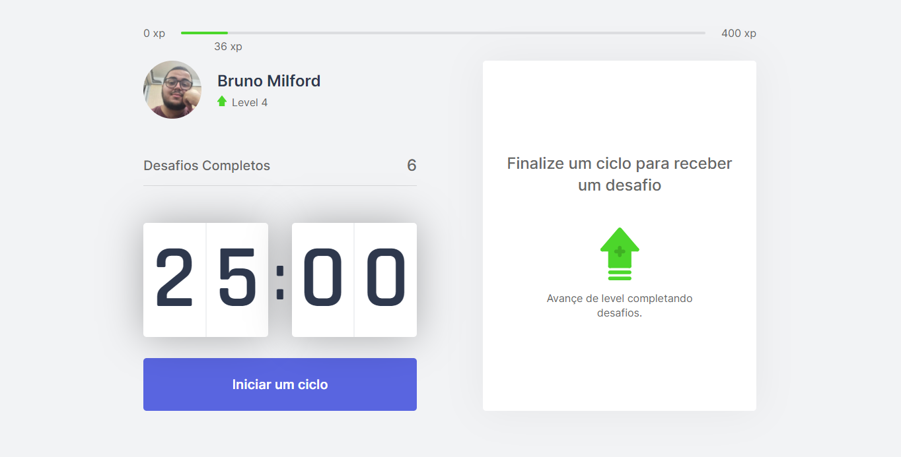
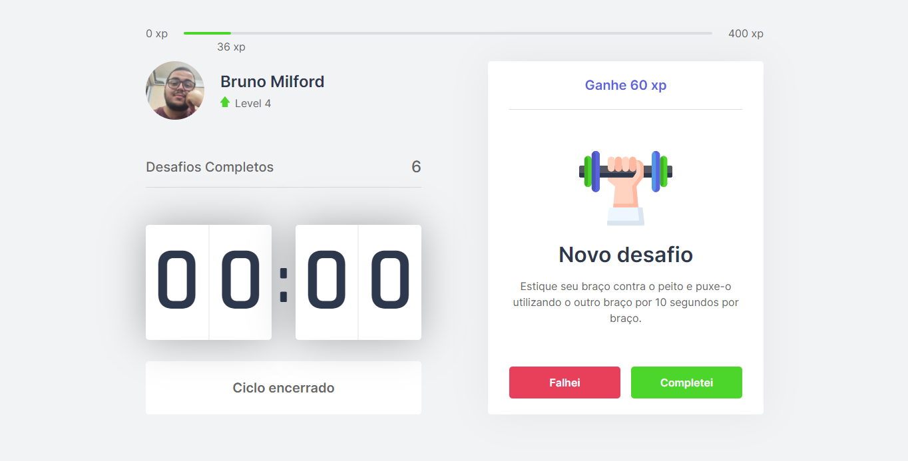

# Move.it

# Sobre o projeto 

O move.it é uma aplicação front-end web feita durante a **NLW - Next Level Week**, o evento foi organizado pela 
<a href="https://rocketseat.com.br/">Rocketseat</a>.

O move.it é um projeto baseado na técnica Pomodoro, que é consistido em dividir ciclos de trabalho com breves intervalos, 
e nesses intervalos o usuário é convidado a realizar um exercício físico, seja ele, para os músculos ou os olhos.

## Tecnologias usadas no move.it

- [React](https://pt-br.reactjs.org/)
- [NextJS](https://nextjs.org/)
- [TypeScript](https://www.typescriptlang.org/)

## Funcionalidades do move.it 

- [x] Subir de nível (levelUp)
- [x] Novo desafio (startNewChallenge)
- [x] Reiniciar desafio (resetChallenge) 
- [x] Desafio Completo (completedChallenge)
- [x] Fecha a notificação (closeLevelUpModal)

- [x] Iniciar um ciclo (startCountdown)
- [x] Abandonar o ciclo (resetCountdown)

- [x] Desafio concluído (handleChallengeSucceeded)
- [x] Desafio não concluído (handleChallengeFailed)

